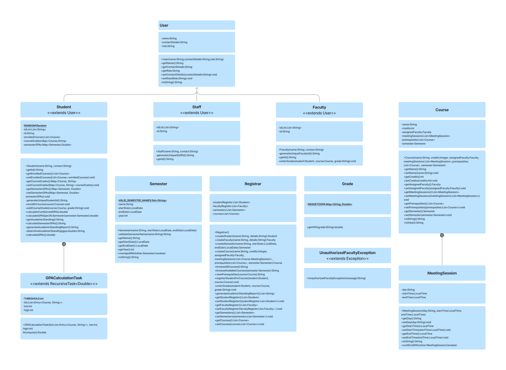

# University Registration System - Java 8 Features & JUnit

## Project Overview
The University Registration System is a Java-based application developed to efficiently handle course registration, class scheduling, student enrollment, and report generation. It leverages Java 8 features such as lambdas, streams, and the new date and time API to ensure a modern, efficient design.

## Getting Started

These instructions will guide you in setting up and running the University Registration System on your local machine for development and testing purposes.

### Prerequisites

Ensure you have the following installed:
- Java JDK 20 or later
- A Java-supporting IDE (e.g., IntelliJ IDEA, Eclipse)
- JUnit (for unit tests)

### Installing

1. **Clone the Repository**  
   ```
   git clone https://github.com/F23-SWER348/uni-registrat-project-n.git
   ```

2. **Open the Project**  
   - Open the cloned project in your IDE.

3. **Build the Project**  
   - Compile the project using your IDE's build feature.
   - Resolve any dependencies.

## Running the Tests

To run the unit tests:

1. **Go to Test Directory**  
   - Locate the `test` directory in the project.

2. **Execute the Tests**  
   - Use the IDE's testing tools to run the tests.
   - Ensure all tests pass.

## Class Diagram

Below is the UML Class Diagram for the University Registration System:



## Built With

- Java 8 Features
- JUnit

## Authors

- Nadine Abuodeh
